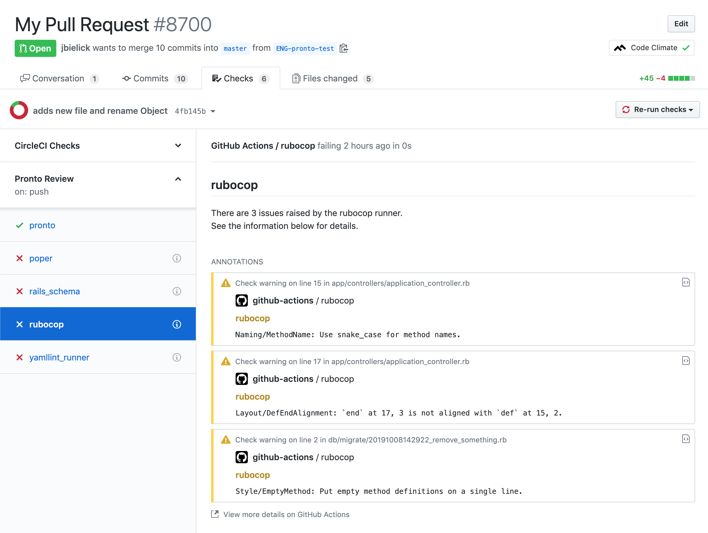

Your all-in-one ruby Pronto runner.

This [GitHub Action](https://github.com/features/actions) runs [Pronto](https://github.com/prontolabs/pronto) [runners](https://github.com/prontolabs/pronto#runners) on your Ruby project diffs and reports back with a [GitHub Check Run](https://developer.github.com/apps/quickstart-guides/creating-ci-tests-with-the-checks-api/).




# Runners
The docker image of this Action includes the following [Pronto Runners](https://github.com/prontolabs/pronto#runners):

- brakeman
- bundler_audit
- eslint_npm
- fasterer
- flay
- poper
- rails_best_practices
- rails_schema
- rails_data_schema
- reek
- rubocop
- scss
- yamllint

# Inputs

| name | description | default |
| --- | --- | --- |
| `runners` | Space-separated list of pronto runners to run. Must be the preinstalled runners from the list above. | `rubocop` |
| `target` | The git target pronto will diff against (`-c`) | `origin/master` |

# Secrets

A GitHub token is available by default when using actions, but you must include it in the `env` map for this Action to use when creating a check run.

Be sure to include the ENV variable in your job step:

```yaml
    - uses: adwerx/pronto-ruby
      env:
        GITHUB_TOKEN: ${{ secrets.GITHUB_TOKEN }}
```

That's it!

# Configuration

Pronto can be configured via the `.pronto.yml` configuration file in your repo.

# Example

With the defaults (only rubocop):

```yaml
name: Pronto

on:
  - push
  - pull_request

jobs:
  run:
    runs-on: ubuntu-latest
    steps:
    - uses: actions/checkout@v1
    - uses: adwerx/pronto-ruby@v2.5
      env:
        GITHUB_TOKEN: ${{ secrets.GITHUB_TOKEN }}
```

With specific runners:

```yaml
name: Pronto
# ...
      with:
        runners: >-
          rubocop rails_schema yamllint
```

If you want to use `actions/checkout@v2`:

```yaml
name: Pronto
# ...
    - uses: actions/checkout@v2
      with:
        fetch-depth: 0
    - run: |
        git fetch --no-tags --prune origin
```

# ESLint

Because of big variety of different plugins and options for ESLint configuration, you need install them manually before running pronto.

Example minimal setup:

```
jobs:
  run:
    runs-on: ubuntu-latest
    steps:
    - uses: actions/checkout@v1
    - uses: borales/actions-yarn@v2.0.0
      with:
        cmd: install
    - uses: adwerx/pronto-ruby@v2.5
      env:
        GITHUB_TOKEN: ${{ secrets.GITHUB_TOKEN }}
      with:
        runners: >-
          eslint_npm
```

Make sure you have `eslint` and all your plugins from `.eslintrc.json` listed on `package.json` for installation.

Here is an example:

__.eslintrc.json__

```
{
  "parser": "babel-eslint",
  "extends": "airbnb",
  "env": {
    "es6": true
  },
  "plugins": [
    "jest"
  ]
}
```

__package.json__

```
{
  "devDependencies": {
    "eslint": "6.8.0",
    "babel-eslint": "^10.0.1",
    "babel-jest": "^24.8.0",
    "eslint-config-airbnb": "^17.1.0",
    "eslint-plugin-import": "^2.17.3",
    "eslint-plugin-jest": "^23.1.1",
    "eslint-plugin-jsx-a11y": "^6.2.1",
    "eslint-plugin-react": "^7.14.1",
  }
}
```

Additionally you need to place special `.pronto_eslint_npm.yml` file to your project root in order to let `pronto` know where to lookup for `eslint` executable:

```
eslint_executable: 'node_modules/.bin/eslint'
```

### Development / Contributions

See [CONTRIBUTING.md](./CONTRIBUTING.md)
